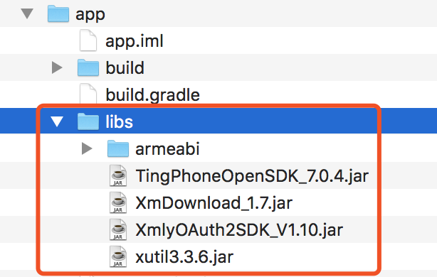

#002: 集成喜马拉雅SDK并验证

#[首页](./../README.md)

##1. 在喜马拉雅官网下载开发SDK
	地址: http://open.ximalaya.com/docNoHelp/sdk?type=common

##2. 配置应用工程的AndroidManifest.xml
	<uses-permission android:name="android.permission.INTERNET" />
	<uses-permission android:name="android.permission.WRITE_EXTERNAL_STORAGE"/>
	<uses-permission android:name="android.permission.ACCESS_WIFI_STATE" />
	<uses-permission android:name="android.permission.ACCESS_NETWORK_STATE" />
	<uses-permission android:name="android.permission.CHANGE_NETWORK_STATE" />
##3. build.gradle中添加SDK依赖的第三方jar包
	dependencies {
	    implementation 'com.squareup.okio:okio:2.2.2'
	    implementation 'com.squareup.okhttp3:okhttp:4.0.1'
	    implementation 'com.google.code.gson:gson:2.8.5'
	}
##4. build.gradle中添加喜马拉雅jar包
	dependencies {
	    implementation fileTree(dir: 'libs', include: ['*.jar'])
	 }
 
##5. 拷贝SDK动态库到应用工程/app/libs

##6. build.grader中添加jniLibs目录
	android{
		sourceSets {
	        main {
	            jniLibs.srcDirs = ['libs']
	        }
	    }
	}
##7. 配置app_key, app_secret和pack_id
* 创建一个BaseApplication类并继承自Application
* 重载onCreate()方法，配置app_key, app_secret和pack_id并初始化
  
  此处的app_key, app_secret, pack_id可以从下载的SDK中的demo项目中TingApplication.java拿到
  
		CommonRequest mXimalaya = CommonRequest.getInstanse();
	    if(DTransferConstants.isRelease) {
	        String mAppSecret = "8646d66d6abe2efd14f2891f9fd1c8af";
	        mXimalaya.setAppkey("9f9ef8f10bebeaa83e71e62f935bede8");
	        mXimalaya.setPackid("com.app.test.android");
	        mXimalaya.init(this ,mAppSecret);
	    } else {
	        String mAppSecret = "0a09d7093bff3d4947a5c4da0125972e";
	        mXimalaya.setAppkey("f4d8f65918d9878e1702d49a8cdf0183");
	        mXimalaya.setPackid("com.ximalaya.qunfeng");
	        mXimalaya.init(this ,mAppSecret);
	    }
* 通过SDK获取喜马拉雅分类数据进行测试
  在MainActivity的onCreate()方法中获取喜马拉雅内容分类
  
  		Map<String, String> map = new HashMap<String, String>();
        CommonRequest.getCategories(map, new IDataCallBack<CategoryList>() {
            @Override
            public void onSuccess(CategoryList object) {
                List<Category> categories = object.getCategories();
                for(Category category : categories){
                    Log.i(TAG, category.getCategoryName());
                }
            }

            @Override
            public void onError(int code, String message) {
                Log.e(TAG, "Get Categories failed, code:" + code + ", message: " + message);
            }
        });
* 代码混淆

* 在proguard-rules.pro文件中加入

		-dontwarn okio.**
		-keep class okio.** { *;}
		​
		-dontwarn okhttp3.**
		-keep class okhttp3.** { *;}
		​
		-dontwarn com.google.gson.**
		-keep class com.google.gson.** { *;}
		​
		-dontwarn android.support.**
		-keep class android.support.** { *;}
		​
		-dontwarn com.ximalaya.ting.android.player.**
		-keep class com.ximalaya.ting.android.player.** { *;}
		​
		-dontwarn com.ximalaya.ting.android.opensdk.**
		-keep interface com.ximalaya.ting.android.opensdk.** {*;}
		-keep class com.ximalaya.ting.android.opensdk.** { *; }
* 安装测试
  
  由于AS中AVD设备CPU都是基于X86架构, 而大多Android App（包括喜马拉雅SDK)依然使用的是arm架构，如果在AVD设备上运行会出现安装错误(install_failed_no_matching_abis)。虽然喜马拉雅SDK官方接口文档中说明支持X86架构(如果贵方没有特殊要求,可以将这三个文件都放置在armeabi中，程序会自动判断平台类型是x86还是armeabi或者armeabi-v7a),但是经过各种尝试后无果，最后还是使用了真机进行测试。
  
  如果在调试输出窗口中能够从喜马拉雅服务器中获取到数据，说明集成基本完成，后面就是完善业务逻辑的过程。

