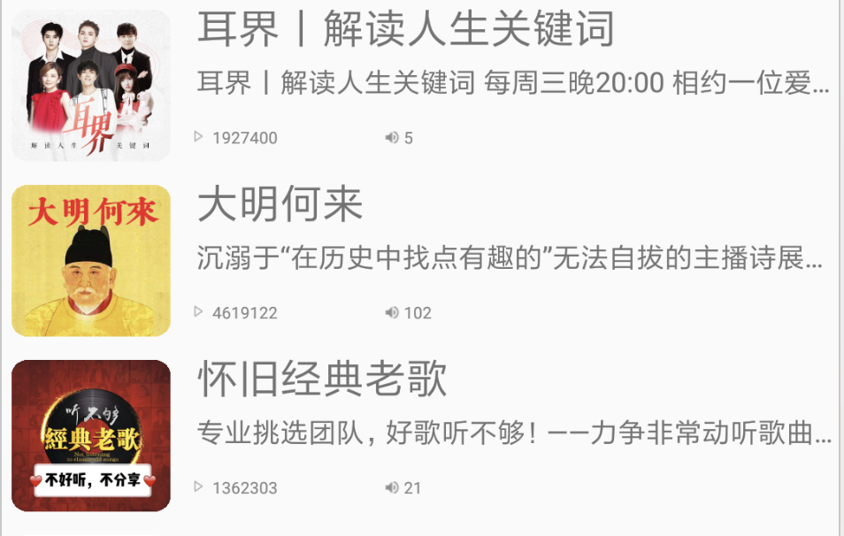
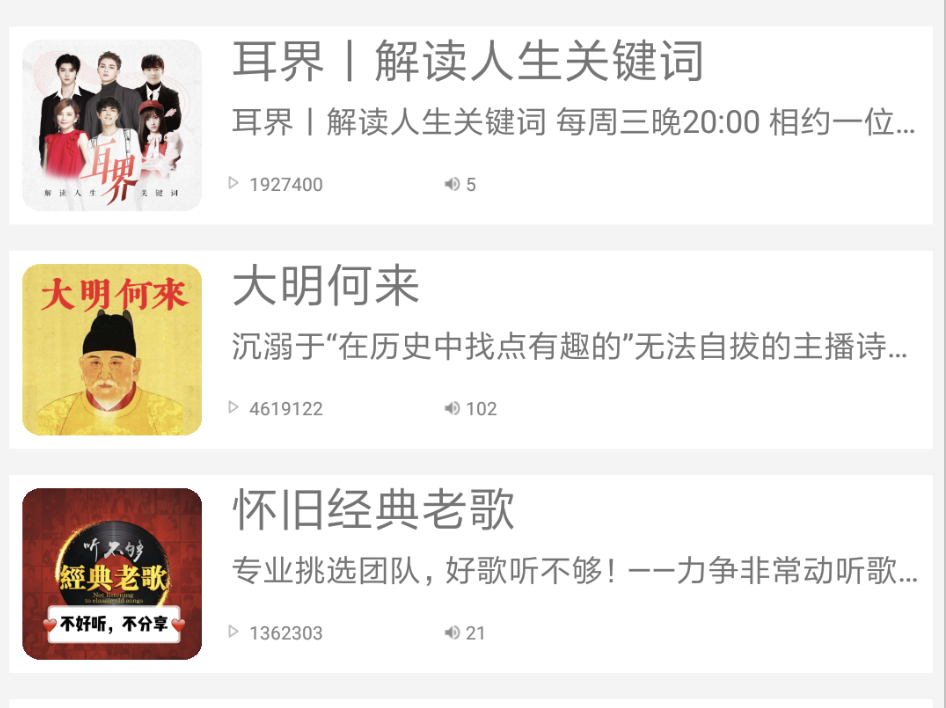
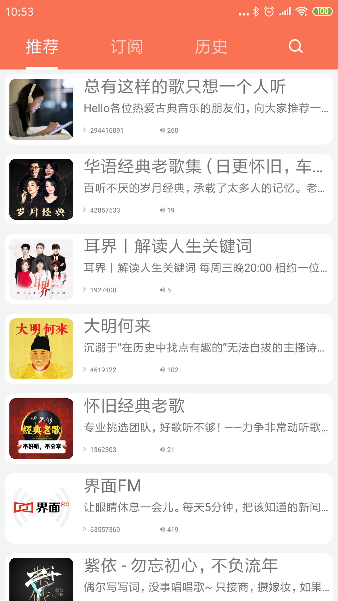

#推荐界面优化

##1.消除上下拉时显示的阴影
在推荐界面布局文件中的RecyclerView中添加一个属性android:overScrollMode="never"

**fragement_recommend.xml:**

	<androidx.recyclerview.widget.RecyclerView
        android:id="@+id/rv_recommend"
        android:overScrollMode="never"
        android:layout_width="match_parent"
        android:layout_height="match_parent" />
        
##2. 专辑封面图像大小调整
在每一项的布局文件item_recommend.xml中的ImageView中添加一个属性android:scaleType="fitXY"

**item_recommend.xml:**

	<ImageView
        android:id="@+id/iv_album_cover"
        android:scaleType="fitXY"
        android:layout_width="68dp"
        android:layout_height="65dp"
        android:layout_marginStart="5dp"
        android:layout_marginTop="5dp"
        android:contentDescription="@string/albumImageView"
        app:layout_constraintStart_toStartOf="parent"
        app:layout_constraintTop_toTopOf="parent" />

##3. 专辑封面圆角设置
###3.1 创建一个自定义控件RoundRectImageView继承于AppcompatImageView,重载onDraw重新绘制图片

	public class RoundRectImageView extends AppCompatImageView {

	    private float roundRatio = 0.1f;
	    private Path path;
	
	    public RoundRectImageView(Context context, AttributeSet attrs) {
	        super(context, attrs);
	    }
	
	    @Override
	    protected void onDraw(Canvas canvas) {
	        if (path == null) {
	            path = new Path();
	            path.addRoundRect(new RectF(0, 0, getWidth(), getHeight()), roundRatio * getWidth(), roundRatio * getHeight(), Path.Direction.CW);
	        }
	        canvas.save();
	        canvas.clipPath(path);
	        super.onDraw(canvas);
	        canvas.restore();
	    }
	}
###3.2 使用自定义控件RoundRectImageView替换中的专辑封面的ImageView
**item_recommend.xml:**

	<com.jupiter.miniximalaya.views.RoundRectImageView
        android:id="@+id/iv_album_cover"
        android:scaleType="fitXY"
        android:layout_width="68dp"
        android:layout_height="65dp"
        android:layout_marginStart="5dp"
        android:layout_marginTop="5dp"
        android:contentDescription="@string/albumImageView"
        app:layout_constraintStart_toStartOf="parent"
        app:layout_constraintTop_toTopOf="parent" />
###3.3 效果图
        
**修改前:**

**修改后:**

	
##4. 专辑之间和边界添加灰色间隙
###4.1 设置ReclyclerView背景色为灰色
android:background="#fff4f4f4"

	<androidx.recyclerview.widget.RecyclerView
        android:background="#fff4f4f4"
        android:id="@+id/rv_recommend"
        android:overScrollMode="never"
        android:layout_width="match_parent"
        android:layout_height="match_parent" />

###4.2 定义一个工具类实现dp和px单位之间的转换
**DPPXConverter.java:**

	public class DPPXConverter {
	
	    public static int dip2px(Context context, double dpValue) {
	        float density = context.getResources().getDisplayMetrics().density;
	        return (int) (dpValue * density + 0.5);
	    }
	
	    public static int getScreenWidth(Context context) {
	        return context.getResources().getDisplayMetrics().widthPixels;
	    }
	}

通过对RecyclerView的边界设置偏移量来达到间隙效果

**RecommendFragment.java:**

	recommendRecyclerView.addItemDecoration(new RecyclerView.ItemDecoration() {
        @Override
        public void getItemOffsets(@NonNull Rect outRect, @NonNull View view, @NonNull RecyclerView parent, @NonNull RecyclerView.State state) {
            outRect.left = DPPXConverter.dip2px(view.getContext(), 5);
            outRect.right = DPPXConverter.dip2px(view.getContext(), 5);
            outRect.top = DPPXConverter.dip2px(view.getContext(), 5);
            outRect.bottom = DPPXConverter.dip2px(view.getContext(), 5);
    	}
   	});

###4.3 效果图
**修改前:**

**修改后:**

##5. 背景圆角
###5.1 创建一个drawable资源文件并作为专辑布局的背景
android:background="@drawable/shape_album_bg"

**shape_album_bg.xml:**

	<?xml version="1.0" encoding="utf-8"?>
	<shape xmlns:android="http://schemas.android.com/apk/res/android" android:shape="rectangle">
	    <solid android:color="#ffffff"/>
	    <corners android:radius="10dp"/>
	</shape>
	
**item_recommend.xml:**

	<androidx.constraintlayout.widget.ConstraintLayout xmlns:android="http://schemas.android.com/apk/res/android"
	    android:layout_width="match_parent"
	    android:layout_height="75dp"
	    android:background="@drawable/shape_album_bg"
	    xmlns:app="http://schemas.android.com/apk/res-auto"
	    xmlns:tools="http://schemas.android.com/tools">

###5.2 效果图
**修改前:**

**修改后:**

##6. 最终效果图

