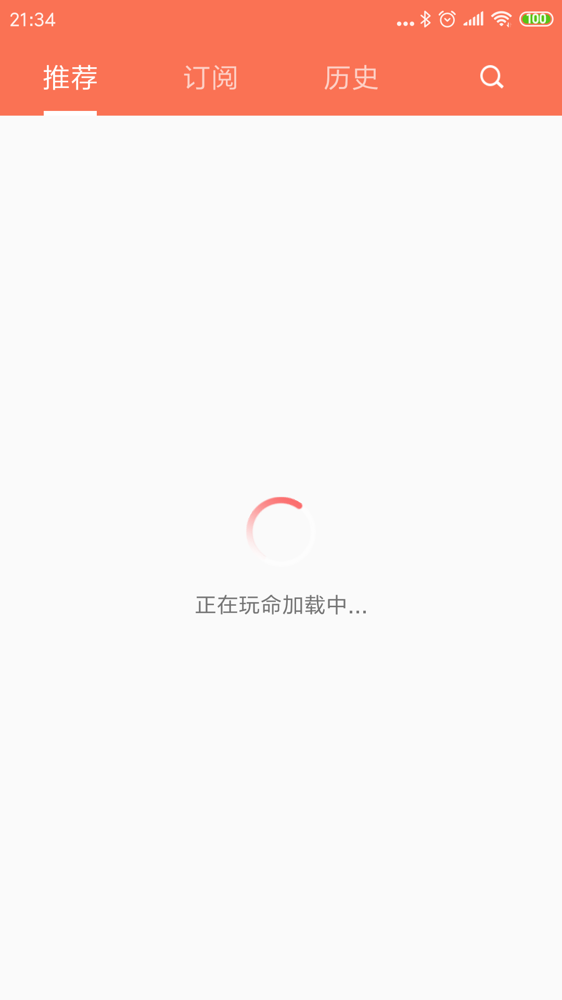

#推荐加载页面优化

##1. 创建一个自定义的ImageView类
由于要实现加载图标动态旋转的效果，创建一个自定义的继承于ImageView的类，并实现旋转效果。

**LoadingView.java:**

	package com.jupiter.miniximalaya.views;
	
	import android.annotation.SuppressLint;
	import android.content.Context;
	import android.graphics.Canvas;
	import android.util.AttributeSet;
	import android.widget.ImageView;
	
	@SuppressLint("AppCompatCustomView")
	public class LoadingView extends ImageView {
	
	    private int rotateDegree = 0;
	
	    private boolean needRotate = false;
	
	    public LoadingView(Context context) {
	        this(context, null);
	    }
	
	    public LoadingView(Context context, AttributeSet attrs) {
	        this(context, attrs, 0 );
	    }
	
	    public LoadingView(Context context, AttributeSet attrs, int defStyleAttr) {
	        super(context, attrs, defStyleAttr);
	    }
	
	    @Override
	    protected void onDraw(Canvas canvas) {
	        /**
	         * 第一个参数是旋转的角度
	         * 第二，三个参数是旋转的X,Y坐标
	         */
	        canvas.rotate(rotateDegree, getWidth()/2, getHeight()/2);
	        super.onDraw(canvas);
	    }
	
	    @Override
	    protected void onAttachedToWindow() {
	        super.onAttachedToWindow();
	        //绑定到Window时
	        needRotate = true;
	        post(new Runnable() {
	            @Override
	            public void run() {
	                rotateDegree += 30;
	                rotateDegree = rotateDegree <=360 ? rotateDegree : 0;
	                invalidate();
	                if(needRotate) {
	                    postDelayed(this, 100);
	                }
	            }
	        });
	    }
	
	    @Override
	    protected void onDetachedFromWindow() {
	        super.onDetachedFromWindow();
	        //解绑窗口时
	        needRotate = false;
	    }
	}

##2. 重新设计加载页面的布局文件

**fragment_loading_view.xml:**

	<?xml version="1.0" encoding="utf-8"?>
	<androidx.constraintlayout.widget.ConstraintLayout xmlns:android="http://schemas.android.com/apk/res/android"
	    xmlns:app="http://schemas.android.com/apk/res-auto"
	    android:layout_width="match_parent"
	    android:layout_height="match_parent">
	
	    <com.jupiter.miniximalaya.views.LoadingView
	        android:id="@+id/iv_recommend_loading"
	        android:layout_width="45dp"
	        android:layout_height="45dp"
	        android:src="@mipmap/loading"
	        app:layout_constraintTop_toTopOf="parent"
	        app:layout_constraintStart_toStartOf="parent"
	        app:layout_constraintEnd_toEndOf="parent"
	        app:layout_constraintBottom_toTopOf="@id/tv_recommend_loading"
	        app:layout_constraintVertical_chainStyle="packed"
	        />
	
	    <TextView
	        android:id="@+id/tv_recommend_loading"
	        android:layout_width="wrap_content"
	        android:layout_height="wrap_content"
	        android:layout_marginTop="14dp"
	        android:text="@string/recommend_loading"
	        app:layout_constraintBottom_toBottomOf="parent"
	        app:layout_constraintEnd_toEndOf="parent"
	        app:layout_constraintStart_toStartOf="parent"
	        app:layout_constraintTop_toBottomOf="@id/iv_recommend_loading"/>
	</androidx.constraintlayout.widget.ConstraintLayout>

##2. 最终效果图

