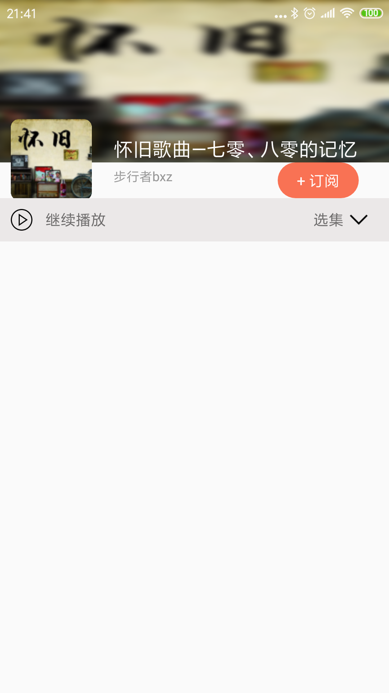

#播放栏布局

##1. 设计播放栏布局
**activity_album_detail.xml:**

	<TextView
        android:id="@+id/tv_album_item_play_container"
        android:layout_width="match_parent"
        android:layout_height="40dp"
        android:background="#EBE8E8"
        app:layout_constraintStart_toStartOf="parent"
        app:layout_constraintEnd_toEndOf="parent"
        app:layout_constraintTop_toBottomOf="@id/tv_subscribe"/>

    <ImageView
        android:id="@+id/iv_album_item_player"
        android:layout_width="20dp"
        android:layout_height="20dp"
        android:layout_marginTop="10dp"
        android:src="@mipmap/play_icon"
        android:layout_marginStart="10dp"
        app:layout_constraintStart_toStartOf="parent"
        app:layout_constraintTop_toTopOf="@id/tv_album_item_play_container"
        tools:srcCompat="@tools:sample/avatars" />

    <TextView
        android:id="@+id/id_album_player_status"
        android:layout_width="wrap_content"
        android:layout_height="wrap_content"
        android:textSize="14sp"
        android:layout_marginTop="10dp"
        android:layout_marginStart="12dp"
        android:text="@string/album_player_continue"
        app:layout_constraintStart_toEndOf="@id/iv_album_item_player"
        app:layout_constraintTop_toTopOf="@id/tv_album_item_play_container" />

    <ImageView
        android:id="@+id/album_item_select"
        android:layout_width="20dp"
        android:layout_height="10dp"
        android:layout_marginTop="15dp"
        android:src="@mipmap/arrow_icon"
        android:layout_marginEnd="18dp"
        app:layout_constraintTop_toTopOf="@id/tv_album_item_play_container"
        tools:srcCompat="@tools:sample/avatars"
        app:layout_constraintEnd_toEndOf="parent"/>

    <TextView
        android:layout_width="wrap_content"
        android:layout_height="wrap_content"
        android:textSize="14sp"
        android:layout_marginTop="10dp"
        android:layout_marginEnd="4dp"
        android:text="@string/album_item_select"
        app:layout_constraintEnd_toStartOf="@id/album_item_select"
        app:layout_constraintTop_toTopOf="@id/tv_album_item_play_container" />

##2. 效果图
