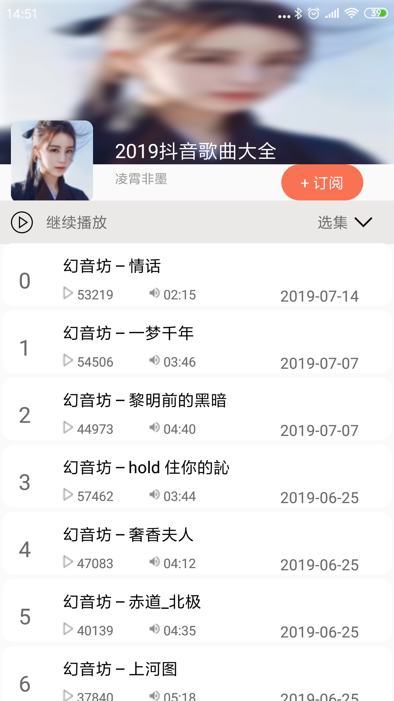

#020: 播放列表布局和数据绑定

#[首页](./../README.md)

##1. 设计播放列表布局
在专辑页面添加一个RecycleView控件
**activity_album_detail.xml:**

	<androidx.recyclerview.widget.RecyclerView
		android:overScrollMode="never"
   		android:id="@+id/rv_album_detail_info"
      	android:layout_width="match_parent"
      	android:layout_height="match_parent"
      	android:layout_marginTop="220dp"
      	app:layout_constraintStart_toStartOf="parent"
      	app:layout_constraintEnd_toEndOf="parent"
      	app:layout_constraintBottom_toBottomOf="parent"
      	app:layout_constraintTop_toBottomOf="@id/tv_album_item_play_container" />

##2. 设计专辑列表中每一项的布局
**item_album_detail.xml:**

	<?xml version="1.0" encoding="utf-8"?>
	<androidx.constraintlayout.widget.ConstraintLayout xmlns:android="http://schemas.android.com/apk/res/android"
    xmlns:tools="http://schemas.android.com/tools"
    android:layout_width="match_parent"
    android:layout_height="wrap_content"
    android:background="@drawable/shape_album_bg"
    xmlns:app="http://schemas.android.com/apk/res-auto">

    <TextView
        android:id="@+id/tv_album_item_detail_index"
        android:layout_width="wrap_content"
        android:layout_height="wrap_content"
        android:textColor="#6C6A6A"
        app:layout_constraintStart_toStartOf="parent"
        app:layout_constraintTop_toTopOf="parent"
        android:layout_marginStart="20dp"
        android:layout_marginTop="20dp"
        android:textSize="20sp"
        android:text="0"/>

    <TextView
        android:id="@+id/tv_album_item_detail_title"
        android:layout_width="250dp"
        android:layout_height="wrap_content"
        android:maxLines="1"
        android:ellipsize="end"
        android:text="逍遥游"
        android:textColor="#000000"
        android:layout_marginStart="40dp"
        android:layout_marginTop="10dp"
        android:textSize="20sp"
        app:layout_constraintEnd_toStartOf="@id/tv_album_item_detail_date"
        app:layout_constraintStart_toEndOf="@id/tv_album_item_detail_index"
        app:layout_constraintTop_toTopOf="parent" />

    <TextView
        android:id="@+id/tv_album_item_detail_date"
        app:layout_constraintEnd_toEndOf="parent"
        app:layout_constraintTop_toTopOf="parent"
        android:text="2018-06"
        android:textColor="#6C6A6A"
        android:layout_marginTop="22dp"
        android:layout_marginEnd="30dp"
        android:layout_width="wrap_content"
        android:layout_height="wrap_content" />

    <ImageView
        android:id="@+id/iv_album_item_play_info"
        android:layout_width="10dp"
        android:layout_height="12dp"
        android:layout_marginTop="9dp"
        app:layout_constraintTop_toBottomOf="@id/tv_album_item_detail_title"
        app:layout_constraintStart_toStartOf="@id/tv_album_item_detail_title"
        android:src="@mipmap/play_info_icon"
        tools:srcCompat="@tools:sample/avatars" />
    <TextView
        android:id="@+id/tv_album_item_play_count"
        android:layout_width="43dp"
        android:layout_height="19dp"
        android:layout_marginTop="8dp"
        android:layout_marginStart="3dp"
        android:textSize="12sp"
        android:textColor="#6C6A6A"
        app:layout_constraintStart_toEndOf="@id/iv_album_item_play_info"
        app:layout_constraintTop_toBottomOf="@id/tv_album_item_detail_title"
        android:text="17.4万"
        />

    <ImageView
        android:id="@+id/iv_album_item_time_info"
        android:layout_width="10dp"
        android:layout_height="12dp"
        android:layout_marginTop="9dp"
        android:layout_marginStart="23dp"
        android:src="@mipmap/ic_sound"
        app:layout_constraintTop_toBottomOf="@id/tv_album_item_detail_title"
        app:layout_constraintStart_toEndOf="@id/tv_album_item_play_count"
        tools:srcCompat="@tools:sample/avatars"/>

    <TextView
        android:id="@+id/tv_album_item_time_info"
        android:layout_width="43dp"
        android:layout_height="19dp"
        android:textSize="12sp"
        android:layout_marginTop="8dp"
        android:layout_marginStart="3dp"
        android:textColor="#6C6A6A"
        app:layout_constraintStart_toEndOf="@id/iv_album_item_time_info"
        app:layout_constraintTop_toBottomOf="@id/tv_album_item_detail_title"
        android:text="05:07" />

	</androidx.constraintlayout.widget.ConstraintLayout>

##2. 创建一个适配器并绑定专辑列表中每一项的布局
**AlbumDetailAdapter.java:**

	public class AlbumDetailAdapter extends RecyclerView.Adapter<AlbumDetailAdapter.InnerHolder> {
	    private List<Track> tracks = new ArrayList<>();
	
	    @NonNull
	    @Override
	    public AlbumDetailAdapter.InnerHolder onCreateViewHolder(@NonNull ViewGroup parent, int viewType) {
	        View view = LayoutInflater.from(parent.getContext()).inflate(R.layout.item_album_detail, parent, false);
	        return new InnerHolder(view);
	    }
	
	    @Override
	    public void onBindViewHolder(@NonNull AlbumDetailAdapter.InnerHolder holder, int position) {
	        holder.setData(tracks.get(position));
	    }
	
	    @Override
	    public int getItemCount() {
	        return tracks.size();
	    }
	
	    public void setAlbumDetailData(List<Track> tracks) {
	        this.tracks.clear();
	        this.tracks.addAll(tracks);
	        notifyDataSetChanged();
	    }
	
	    public class InnerHolder extends RecyclerView.ViewHolder {
	        public InnerHolder(@NonNull View itemView) {
	            super(itemView);
	        }
	
	        public void setData(Track track) {
	
	        }
	    }
	}

##3. 专辑页面绑定布局管理器和专辑适配器
**AlbumDetailActivity.java:**

	LinearLayoutManager linearLayoutManager = new LinearLayoutManager(this);
   	albumDetailInfo.setLayoutManager(linearLayoutManager);
	albumDetailAdapter = new AlbumDetailAdapter();
	albumDetailInfo.setAdapter(albumDetailAdapter);
##4. 专辑页面中每一项中间加入间隔
**AlbumDetailActivity.java:**

	albumDetailInfo.addItemDecoration(new RecyclerView.ItemDecoration() {
        @Override
        public void getItemOffsets(@NonNull Rect outRect, @NonNull View view, @NonNull RecyclerView parent, @NonNull RecyclerView.State state) {
            outRect.left = DPPXConverter.dip2px(view.getContext(), 5);
            outRect.right = DPPXConverter.dip2px(view.getContext(), 5);
            outRect.top = DPPXConverter.dip2px(view.getContext(), 5);
            outRect.bottom = DPPXConverter.dip2px(view.getContext(), 5);
        }
    });

##3. 绑定数据
**AlbumDetailAdapter.java:**

	public class InnerHolder extends RecyclerView.ViewHolder {
        public InnerHolder(@NonNull View itemView) {
            super(itemView);
        }

        public void setData(Track track, int position) {
            TextView itemIndex = itemView.findViewById(R.id.tv_album_item_detail_index);
            TextView itemTitle = itemView.findViewById(R.id.tv_album_item_detail_title);
            TextView itemDate = itemView.findViewById(R.id.tv_album_item_detail_date);
            TextView itemPlayCount = itemView.findViewById(R.id.tv_album_item_play_count);
            TextView itemPlayDuration = itemView.findViewById(R.id.tv_album_item_play_duration);

            itemIndex.setText(position + "");
            itemTitle.setText(track.getTrackTitle());
            String updateDate = updateDateFormat.format(track.getUpdatedAt());
            itemDate.setText(updateDate);
            itemPlayCount.setText(track.getPlayCount() + "");
            String playDuration = playDurationFormat.format(track.getDuration() * 1000);
            itemPlayDuration.setText(playDuration);
        }
    }
    
##4. 效果图
