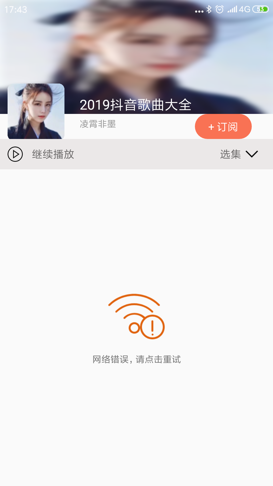

#021: 获取播放列表异常情况处理

#[首页](./../README.md)

在获取专辑播放列表是有可能网速慢，网络故障，或者获取数据为的情况，那么就需要展示不同的页面。

##1. 修改播放列表布局文件
由于可能出现不同的情况，所以使用FragmentLayout替换RecycleView控件
**activity_album_detail.xml:**

	<FrameLayout
        android:id="@+id/fl_album_detail_info"
        app:layout_constraintStart_toStartOf="parent"
        android:layout_marginTop="220dp"
        app:layout_constraintEnd_toEndOf="parent"
        app:layout_constraintBottom_toBottomOf="parent"
        app:layout_constraintTop_toBottomOf="@id/tv_album_item_play_container"
        android:layout_width="wrap_content"
        android:layout_height="match_parent">
    </FrameLayout>
    
##2. 创建一个Fragment布局文件并添加RecycleView控件
**item_album_detail_list.xml:**

	<?xml version="1.0" encoding="utf-8"?>
	<FrameLayout
    xmlns:android="http://schemas.android.com/apk/res/android"
    android:layout_width="match_parent"
    android:layout_height="match_parent">

    <androidx.recyclerview.widget.RecyclerView
        android:overScrollMode="never"
        android:id="@+id/rv_album_detail_info"
        android:layout_width="match_parent"
        android:layout_height="match_parent"/>
	</FrameLayout>

##2. 使用UILoader工具类根据不同的状况加载不同的页面
**AlbumDetailActivity.java:**

	private void initView() {
        albumLargeCover = findViewById(R.id.iv_album_large_cover);
        albumSmallCover = findViewById(R.id.iv_album_small_cover);
        albumTitle = findViewById(R.id.tv_album_item_title);
        albumAuthor = findViewById(R.id.tv_album_item_author);

        albumDetailContainer = findViewById(R.id.fl_album_detail_info);

        if(null == uiLoader) {
            uiLoader = new UILoader(this) {
                @Override
                protected View getSuccessView(ViewGroup container) {
                    return createSuccessView(container);
                }
            };
        }
        uiLoader.setRetryClickListener(this);
        albumDetailContainer.removeAllViews();
        albumDetailContainer.addView(uiLoader);
    }
   
   	private View createSuccessView(ViewGroup container) {

        View successView = LayoutInflater.from(this).inflate(R.layout.item_album_detail_list, container, false);

        albumDetailInfo = successView.findViewById(R.id.rv_album_detail_info);
        LinearLayoutManager linearLayoutManager = new LinearLayoutManager(this);
        albumDetailInfo.setLayoutManager(linearLayoutManager);

        albumDetailAdapter = new AlbumDetailAdapter();
        albumDetailInfo.setAdapter(albumDetailAdapter);
        albumDetailInfo.addItemDecoration(new RecyclerView.ItemDecoration() {
            @Override
            public void getItemOffsets(@NonNull Rect outRect, @NonNull View view, @NonNull RecyclerView parent, @NonNull RecyclerView.State state) {
                outRect.left = DPPXConverter.dip2px(view.getContext(), 2);
                outRect.right = DPPXConverter.dip2px(view.getContext(), 2);
                outRect.top = DPPXConverter.dip2px(view.getContext(), 2);
                outRect.bottom = DPPXConverter.dip2px(view.getContext(), 2);
            }
        });

        return successView;
    }

##3. 根据不同情况切换不同状态 
**AlbumDetailActivity.java:**

	@Override
    public void onAlbumDetailLoaded(List<Track> tracks) {
        if(null == tracks){
            return;
        }
        uiLoader.updateUIStatus(UILoader.UIStatus.SUCCESS);
        albumDetailAdapter.setAlbumDetailData(tracks);
    }
    
    @Override
    public void onLoading() {
        uiLoader.updateUIStatus(UILoader.UIStatus.LOADING);
    }

    @Override
    public void onError(int errorCode, String desc) {
        uiLoader.updateUIStatus(UILoader.UIStatus.ERROR);
    }

    @Override
    public void onEmpty() {
        uiLoader.updateUIStatus(UILoader.UIStatus.EMPTY);
    }
    
    @Override
    public void onRetry() {
        //重新获取专辑列表数据
        albumDetailPresenter.getAlbumDetail((int)albumId, albumPageIndex);
    }
    
##4. 效果图
**加载中**:

**没有内容**

**加载出错**

