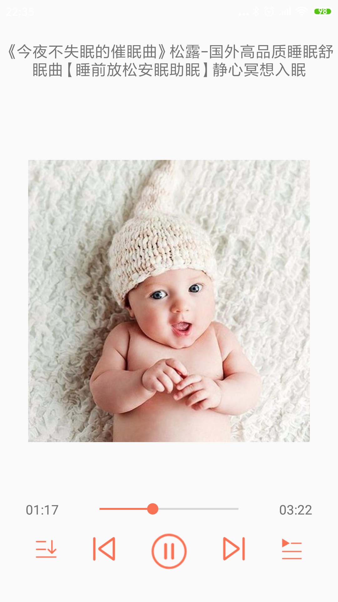

#028: 播放器封面设置

#[首页](./../README.md)

##1. 创建一个播放器封面适配器用于加载封面图像

**TrackPlayPageAdapter.java:**

	public class TrackPlayPageAdapter extends PagerAdapter {
	    @Override
	    public int getCount() {
	        return 0;
	    }
	
	    @Override
	    public boolean isViewFromObject(@NonNull View view, @NonNull Object object) {
	        return view == object;
	    }
	}

##2. 绑定到播放器封面控件

**TrackPlayerActivity.java:**

	private void initView() {
		...
		playCoverViewPager = findViewById(R.id.vp_track_cover);
        trackPlayPageAdapter = new TrackPlayPageAdapter();
        playCoverViewPager.setAdapter(trackPlayPageAdapter);
    }
##3. 获取播放器列表并传递给适配器

**PlayerPresenter.java:**

	public void getPlayList() {
        if (xmPlayerManager != null) {
            List<Track> playList = xmPlayerManager.getPlayList();
            for (IPlayerCallback playerCallback : playerCallbacks) {
                playerCallback.onPlayList(playList);
            }
        }
    }

**TrackPlayerActivity.java:**

	public void onPlayList(List<Track> tracks) {
        if (trackPlayPageAdapter != null) {
            trackPlayPageAdapter.setData(tracks);
        }
    }
    
**TrackPlayPageAdapter.java:**

	public void setData(List<Track> tracks) {
        this.tracks.clear();
        this.tracks.addAll(tracks);
        notifyDataSetChanged();
    }
    
##4. 设置适配器布局文件

**item_play_cover.xml**

	<androidx.constraintlayout.widget.ConstraintLayout
    xmlns:android="http://schemas.android.com/apk/res/android"
    xmlns:app="http://schemas.android.com/apk/res-auto"
    xmlns:tools="http://schemas.android.com/tools"
    android:layout_width="match_parent"
    android:layout_height="match_parent">

    <ImageView
        android:id="@+id/iv_play_cover"
        android:layout_width="300dp"
        android:layout_height="300dp"
        app:layout_constraintBottom_toBottomOf="parent"
        app:layout_constraintEnd_toEndOf="parent"
        app:layout_constraintStart_toStartOf="parent"
        app:layout_constraintTop_toTopOf="parent"
        tools:srcCompat="@tools:sample/avatars" />
	</androidx.constraintlayout.widget.ConstraintLayout>
##5.适配器绑定布局文件并更新封面

**TrackPlayPageAdapter.java:**

	public Object instantiateItem(@NonNull ViewGroup container, int position) {

        View view = LayoutInflater.from(container.getContext()).inflate(R.layout.item_play_cover, container, false);
        container.addView(view);
        ImageView imageView = view.findViewById(R.id.iv_play_cover);
        Track track = tracks.get(position);
        String playCoverImage = track.getCoverUrlLarge();
        Picasso.with(view.getContext()).load(playCoverImage).into(imageView);
        return view;
    }
    
    @Override
    public void destroyItem(@NonNull ViewGroup container, int position, @NonNull Object object) {
        container.removeView((View) object);
    }
 
##6. 效果图
