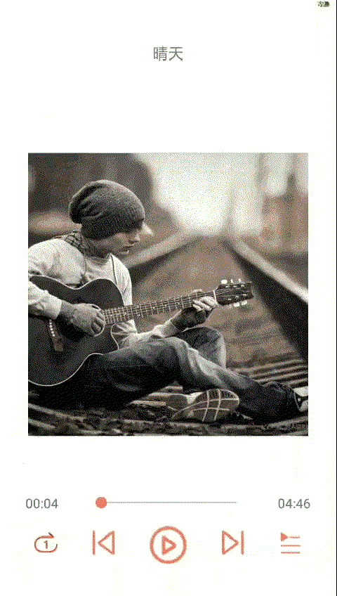

#032: 播放器播放列表设置

#[首页](./../README.md)

点击播放器播放按钮应该弹出一个播放列表窗口，这个窗口应该是属于一种PopupWindow类型.

##1. 创建一个播放列表的布局文件

**pop_play_list.xml:**

	<androidx.constraintlayout.widget.ConstraintLayout xmlns:android="http://schemas.android.com/apk/res/android"
	    xmlns:tools="http://schemas.android.com/tools"
	    android:layout_width="match_parent"
	    android:layout_height="match_parent"
	    xmlns:app="http://schemas.android.com/apk/res-auto">
	
	    <androidx.recyclerview.widget.RecyclerView
	        android:layout_width="match_parent"
	        android:layout_height="400dp"
	        android:background="#00eeee"
	        app:layout_constraintStart_toStartOf="parent"
	        app:layout_constraintTop_toTopOf="parent"/>
	</androidx.constraintlayout.widget.ConstraintLayout>

##2. 创建一个播放列表窗口类继承于PopupWindow

**PlayListPopupWindow.java:**

	public class PlayListPopupWindow extends PopupWindow {
	
	    public PlayListPopupWindow(){
	        super(ViewGroup.LayoutParams.MATCH_PARENT, ViewGroup.LayoutParams.WRAP_CONTENT);
	
	        View playListView = LayoutInflater.from(BaseApplication.getAppContext()).inflate(R.layout.pop_play_list, null);
	        setContentView(playListView);
	    }
	}
##3. 播放器播放列表按钮创建点击监听事件，并显示播放列表窗口

**TrackPlayerActivity.java:**

	if (playListView != null) {
        playListView.setOnClickListener(new View.OnClickListener() {
            @Override
            public void onClick(View view) {
                playListPopupWindow.showAtLocation(view, Gravity.BOTTOM, 0, 0);
            }
        });
    }
##4. 播放列表窗口边框圆角设置
###4.1 创建一个资源文件

**shape_play_list_bg.xml:**

	<shape xmlns:android="http://schemas.android.com/apk/res/android" android:shape="rectangle">
	    <corners android:topLeftRadius="20dp" android:topRightRadius="20dp"/>
	    <solid android:color="#afafaf"/>
	</shape>
###4.2 布局文件背景设置

**pop_play_list.xml:**

	<androidx.constraintlayout.widget.ConstraintLayout xmlns:android="http://schemas.android.com/apk/res/android"
	    xmlns:tools="http://schemas.android.com/tools"
	    android:layout_width="match_parent"
	    android:layout_height="match_parent"
	    android:background="@drawable/shape_play_list_bg"
	    xmlns:app="http://schemas.android.com/apk/res-auto">
	
	    <androidx.recyclerview.widget.RecyclerView
	        android:layout_width="match_parent"
	        android:layout_height="400dp"
	        app:layout_constraintStart_toStartOf="parent"
	        app:layout_constraintTop_toTopOf="parent"/>
	</androidx.constraintlayout.widget.ConstraintLayout>

##5. 点击其他位置播放列表窗口消失
	public class PlayListPopupWindow extends PopupWindow {
	
	    public PlayListPopupWindow(){
	        super(ViewGroup.LayoutParams.MATCH_PARENT, ViewGroup.LayoutParams.WRAP_CONTENT);
	
	        //设置外部点击Pop窗口消失前，要设置setBackgroundDrawable,否则无效
	        setBackgroundDrawable(new ColorDrawable(Color.TRANSPARENT));
	        setOutsideTouchable(true);
	
	        View playListView = LayoutInflater.from(BaseApplication.getAppContext()).inflate(R.layout.pop_play_list, null);
	        setContentView(playListView);
	    }
	}
	
##6. 播放列表窗口弹出时，其他窗口界面变灰
通过调整窗口的Alpha值实现变灰

**TrackPlayerActivity.java:**

	if (playListView != null) {
        playListView.setOnClickListener(new View.OnClickListener() {
            @Override
            public void onClick(View view) {
                playListPopupWindow.showAtLocation(view, Gravity.BOTTOM, 0, 0);
                updateBgAlpha(0.8f);
            }
        });
    }
    
 	private void updateBgAlpha(float alpha){
        WindowManager.LayoutParams attributes = getWindow().getAttributes();
        attributes.alpha = alpha;
        getWindow().setAttributes(attributes);
    }
    
##7. 播放列表窗口消失时，恢复其他窗口透明度

**TrackPlayerActivity.java:**

	if (playListPopupWindow != null) {
        playListPopupWindow.setOnDismissListener(new PopupWindow.OnDismissListener() {
            @Override
            public void onDismiss() {
                updateBgAlpha(1.0f);
            }
        });
    }
  
  	private void updateBgAlpha(float alpha){
        WindowManager.LayoutParams attributes = getWindow().getAttributes();
        attributes.alpha = alpha;
        getWindow().setAttributes(attributes);
    }
##8. 播放列表窗口弹出和消失动画效果
###8.1 创建资源动画目录
res/anim
###8.2 创建进入和退出动画资源文件
在res/anim目录下创建进入和退出的动画资源

**pop_enter.xml:**

	<set xmlns:android="http://schemas.android.com/apk/res/android">
	    <translate
	        android:duration="300"
	        android:fromYDelta="100%"
	        android:toYDelta="0"/>
	    <alpha
	        android:duration="300"
	        android:fromAlpha="1.0"
	        android:toAlpha="0.8"/>
	</set>

**pop_exit.xml:**

	<?xml version="1.0" encoding="utf-8"?>
	<set xmlns:android="http://schemas.android.com/apk/res/android">
	    <translate
	        android:duration="300"
	        android:fromYDelta="0"
	        android:toYDelta="100%"/>
	    <alpha
	        android:duration="300"
	        android:fromAlpha="0.8"
	        android:toAlpha="1.0"/>
	</set>
###8.3 创建动画风格文件

**styles.xml:**

	
    
###8.4 播放器列表弹出窗口绑定动画效果

**PlayListPopupWindow.java:**

	public class PlayListPopupWindow extends PopupWindow {
	
	    public PlayListPopupWindow(){
	        super(ViewGroup.LayoutParams.MATCH_PARENT, ViewGroup.LayoutParams.WRAP_CONTENT);
	
	        //设置外部点击Pop窗口消失前，要设置setBackgroundDrawable,否则无效
	        setBackgroundDrawable(new ColorDrawable(Color.TRANSPARENT));
	        setOutsideTouchable(true);
	
	        View playListView = LayoutInflater.from(BaseApplication.getAppContext()).inflate(R.layout.pop_play_list, null);
	        setContentView(playListView);
	
	        //设置窗口进入和退出动画
	        setAnimationStyle(R.style.playListPopAnimation);
	    }
	}
###8.5 播放器列表窗口弹出或消失背景阴影动画效果

**TrackPlayerActivity.java:**

创建动画效果

	private void initAnimator() {
        enterAnimator = ValueAnimator.ofFloat(1.0f, 0.7f);
        enterAnimator.setDuration(500);
        enterAnimator.addUpdateListener(new ValueAnimator.AnimatorUpdateListener() {
            @Override
            public void onAnimationUpdate(ValueAnimator valueAnimator) {
                updateBgAlpha((float)valueAnimator.getAnimatedValue());
            }
        });
	
        exitAnimator = ValueAnimator.ofFloat(0.7f, 1.0f);
        exitAnimator.setDuration(500);
        exitAnimator.addUpdateListener(new ValueAnimator.AnimatorUpdateListener() {
            @Override
            public void onAnimationUpdate(ValueAnimator valueAnimator) {
                updateBgAlpha((float)valueAnimator.getAnimatedValue());
            }
        });
    }
绑定窗口弹出和消失监听事件

	if (playListView != null) {
        playListView.setOnClickListener(new View.OnClickListener() {
            @Override
            public void onClick(View view) {
                playListPopupWindow.showAtLocation(view, Gravity.BOTTOM, 0, 0);
                enterAnimator.start();
            }
        });
    }
	
    if (playListPopupWindow != null) {
        playListPopupWindow.setOnDismissListener(new PopupWindow.OnDismissListener() {
            @Override
            public void onDismiss() {
                exitAnimator.start();
            }
        });
    }
##9. 效果图
