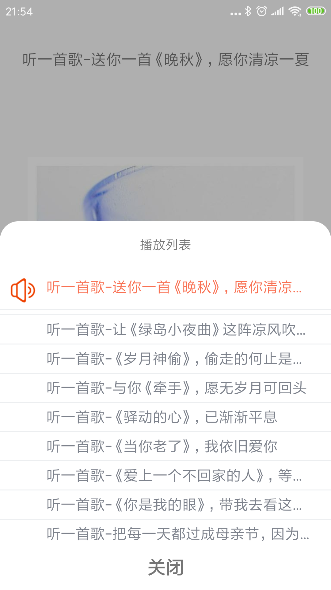

#034: 播放器列表数据绑定

#[首页](./../README.md)

##1. 播放器列表播放列表创建一个适配器

**TrackPlayListAdapater.java:**

	public class TrackPlayListAdapter extends RecyclerView.Adapter<TrackPlayListAdapter.InnerHolder>{
	
	    private List<Track> tracks = new ArrayList<>();
	
	    @NonNull
	    @Override
	    public InnerHolder onCreateViewHolder(@NonNull ViewGroup parent, int viewType) {
	
	        View itemView = LayoutInflater.from(parent.getContext()).inflate(R.layout.item_play_list, parent, false);
	
	        return new InnerHolder(itemView);
	    }
	
	    @Override
	    public void onBindViewHolder(@NonNull InnerHolder holder, int position) {
	        Track track = tracks.get(position);
	        TextView playListTitle = holder.itemView.findViewById(R.id.tv_play_list_title);
	        playListTitle.setText(track.getTrackTitle());
	    }
	
	    @Override
	    public int getItemCount() {
	        return tracks.size();
	    }
	
	    public void setData(List<Track> tracks) {
	        this.tracks.clear();
	        this.tracks.addAll(tracks);
	        notifyDataSetChanged();
	    }
	
	    public class InnerHolder extends RecyclerView.ViewHolder {
	        public InnerHolder(@NonNull View itemView) {
	            super(itemView);
	        }
	    }
	}

##2. 播放器列表播放列表绑定布局管理器和适配器

**PlayListPopupWindow.java:**

	LinearLayoutManager linearLayoutManager = new 	LinearLayoutManager(BaseApplication.getAppContext());
    playListRecycleView.setLayoutManager(linearLayoutManager);

    trackPlayListAdapter = new TrackPlayListAdapter();
    playListRecycleView.setAdapter(trackPlayListAdapter);
    
##3. 绑定专辑列表到适配器

**TrackPlayerActivity.java:**

	public void onPlayList(List<Track> tracks) {
        if (playListPopupWindow != null) {
            playListPopupWindow.setData(tracks);
        }
    }
    
 **PlayListPopupWindow.java:**

	public void setData(List<Track> tracks) {
        if (trackPlayListAdapter != null) {
            trackPlayListAdapter.setData(tracks);
        }
    }
##4. 修改正在播放节目标题颜色和图标显示

**TrackPlayListAdapater.java:**

	public void onBindViewHolder(@NonNull InnerHolder holder, int position) {
        Track track = tracks.get(position);
        TextView playListTitle = holder.itemView.findViewById(R.id.tv_play_list_title);
        playListTitle.setText(track.getTrackTitle());
	
        ImageView playListIcon = holder.itemView.findViewById(R.id.iv_play_list_icon);
	
        if(position == playingIndex){
            playListIcon.setVisibility(View.VISIBLE);
            playListTitle.setTextColor(BaseApplication.getAppContext().getResources().getColor(R.color.subscribe_color));
        }
        else{
            playListIcon.setVisibility(View.GONE);
            playListTitle.setTextColor(BaseApplication.getAppContext().getResources().getColor(R.color.play_list_title_color));
        }
    }
    
##4. 效果图
