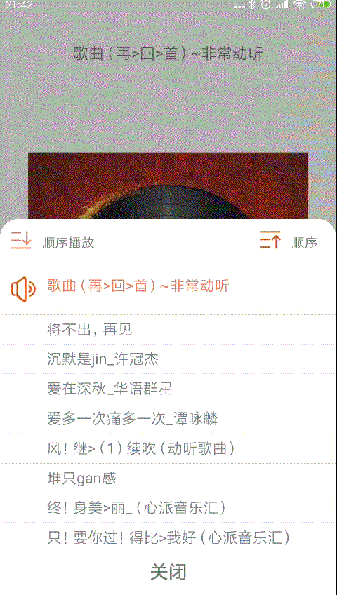

#036: 播放器弹出窗口播放顺序切换

#[首页](./../README.md)

通过点击播放顺序图标可以切换顺序或者逆序播放

##1. 添加播放顺序图标和文字到布局文件中

**pop_play_list.xml:**

	<ImageView
        android:id="@+id/iv_play_list_sort"
        android:layout_width="25dp"
        android:layout_height="25dp"
        app:layout_constraintTop_toTopOf="parent"
        android:layout_marginTop="10dp"
        android:layout_marginEnd="10dp"
        app:layout_constraintEnd_toStartOf="@id/tv_playlist_sort"
        android:src="@drawable/selector_playlist_sort_ascending"
        tools:srcCompat="@tools:sample/avatars" />

    <TextView
        android:id="@+id/tv_playlist_sort"
        android:layout_width="wrap_content"
        android:layout_height="50dp"
        android:text="@string/play_list_sort_ascending"
        android:gravity="center"
        android:layout_marginEnd="20dp"
        app:layout_constraintEnd_toEndOf="parent"
        app:layout_constraintBottom_toTopOf="@id/rv_playlist_container"
        app:layout_constraintTop_toTopOf="parent"/>

##2. 添加点击事件并回调注册方法

**PlayListPopupWindow.java:**

	playListSortImageView.setOnClickListener(new View.OnClickListener() {
        @Override
        public void onClick(View view) {
            playListClickListener.onPlaySortClick();
        }
    });

    playListSortTextView.setOnClickListener(new View.OnClickListener() {
        @Override
        public void onClick(View view) {
            playListClickListener.onPlaySortClick();
        }
    });
    
##3. 调用喜马拉雅SDK更新播放列表并更新UI界面

**PlayerPresenter.java:**

	@Override
    public void reversePlayList() {

        if (xmPlayerManager != null) {
            Collections.reverse(tracks);
            isAscending = !isAscending;
            currentPlayIndex = tracks.size() - currentPlayIndex - 1;
            xmPlayerManager.setPlayList(tracks, currentPlayIndex);
            PlayableModel currSound = xmPlayerManager.getCurrSound();

            for (IPlayerCallback playerCallback : playerCallbacks) {
                playerCallback.onPlayList(tracks);
                playerCallback.onSoundSwitch(currSound, currSound, currentPlayIndex);
                playerCallback.onPlaySortChange(isAscending);
            }
        }
    }
 
**TrackPlayerActivity.java:**

	public void onPlaySortChange(boolean isAscending) {
        playListPopupWindow.setPlayListSort(!isAscending);
    }

**PlayListPopupWindow.java:**

	public void setPlayListSort(boolean isAscending){
        if(isAscending){
            playListSortImageView.setImageResource(R.drawable.selector_playlist_sort_ascending);
            playListSortTextView.setText(R.string.play_list_sort_ascending);
        }
        else{
            playListSortImageView.setImageResource(R.drawable.selector_playlist_sort_descending);
            playListSortTextView.setText(R.string.play_list_sort_descending);
        }
    }
##4.效果图
