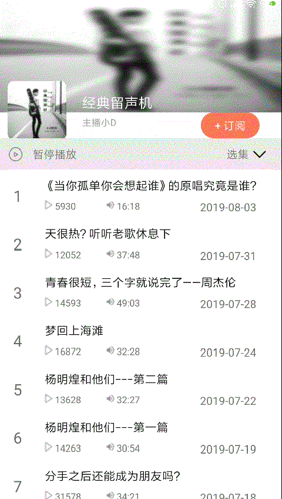

#037: 播放状态的绑定

#[首页](./../README.md)

在播放器和专辑列表窗口都有播放状态，这2个窗口的播放状态要保持一致，在一个窗口改变播放状态要实时反应到另外另一个窗口中。

##1. 专辑列表窗口注册到PlayerPresenter并实现回调方法改变播放状态

**AlbumDetailActivity.java:**

	protected void onCreate(Bundle savedInstanceState) {
		...
		playerPresenter = PlayerPresenter.getsInstance();
	   	playerPresenter.registerCallback(this);
	}
	
	@Override
    public void onPlayStart() {

        if (playStatusImageView != null && playStatusTextView != null) {
            playStatusImageView.setImageResource(R.drawable.selector_playstatus_pause);
            playStatusTextView.setText(R.string.album_player_playing);
        }
    }

    @Override
    public void onPlayPause() {
        if (playStatusImageView != null && playStatusTextView != null) {
            playStatusImageView.setImageResource(R.drawable.selector_playstatus_playing);
            playStatusTextView.setText(R.string.album_player_pause);
        }
    }

    @Override
    public void onPlayStop() {
        if (playStatusImageView != null && playStatusTextView != null) {
            playStatusImageView.setImageResource(R.drawable.selector_playstatus_playing);
            playStatusTextView.setText(R.string.album_player_pause);
        }
    }
##2. 点击播放列表中播放状态改变播放器播放状态

**AlbumDetailActivity.java:**

	private void initEvent() {

        playStatusImageView.setOnClickListener(new View.OnClickListener() {
            @Override
            public void onClick(View view) {
                updatePlayStatus();
            }
        });

        playStatusTextView.setOnClickListener(new View.OnClickListener() {
            @Override
            public void onClick(View view) {
                updatePlayStatus();
            }
        });
    }

    private void updatePlayStatus(){
        if (playerPresenter != null) {
            if (playerPresenter.isPlaying()) {
                playerPresenter.pause();
            }
            else{
                playerPresenter.play();
            }
        }
    }
##3. 专辑页面首次点击播放按钮不播放问题解决
在首次进入专辑页面并点击播放按钮时并不会触发播放功能，主要原因是没有把播放列表设置到喜马拉雅SDK

**AlbumDetailActivity.java:**

	private void initEvent() {

	    playStatusImageView.setOnClickListener(new View.OnClickListener() {
	        @Override
	        public void onClick(View view) {
	            checkAndUpdatePlayStatus();
	        }
	    });
	
	    playStatusTextView.setOnClickListener(new View.OnClickListener() {
	        @Override
	        public void onClick(View view) {
	            checkAndUpdatePlayStatus();
	        }
	    });
	}
	
	private void checkAndUpdatePlayStatus(){
        if (playerPresenter != null) {
            if(playerPresenter.hasSetPlayList()) {
                updatePlayStatus();
            }
            else{
                setPlayList();
            }
        }
    }

    private void setPlayList() {
        if(playerPresenter != null){
            playerPresenter.setPlayList(tracks, 0);
        }
    }

    private void updatePlayStatus() {
        if (playerPresenter.isPlaying()) {
            playerPresenter.pause();
        }
        else{
            playerPresenter.play();
        }
    }
##4. 效果图
