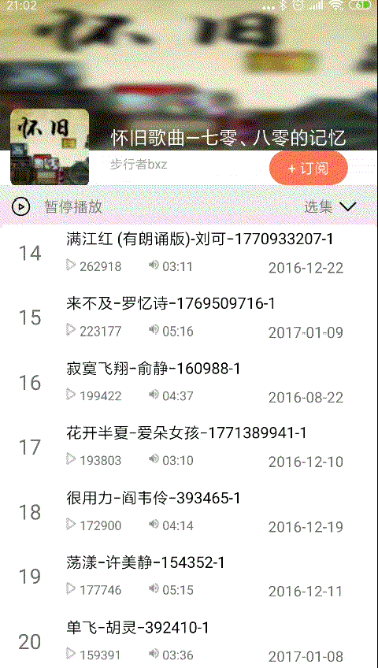

#039: 专辑列表加载更多

#[首页](./../README.md)

##1. 调用喜马拉雅SDK获取更多专辑列表

**AlbumDetailActivity.java:**

	private View createSuccessView(ViewGroup container) {
		...
      albumDetailRefreshLayout.setOnRefreshListener(new RefreshListenerAdapter() {
          
            @Override
            public void onLoadMore(TwinklingRefreshLayout refreshLayout) {
                super.onLoadMore(refreshLayout);
                isLoadingMore = true;
                albumDetailPresenter.loadMore();
            }
        });
	}
	
	@Override
    public void onAlbumDetailLoaded(List<Track> tracks) {
        if(null == tracks){
            return;
        }
        if (isLoadingMore) {
        	//完成加载更多
            albumDetailRefreshLayout.finishLoadmore();
            isLoadingMore = false;
        }
        this.tracks.clear();
        this.tracks.addAll(tracks);
        uiLoader.updateUIStatus(UILoader.UIStatus.SUCCESS);
        albumDetailAdapter.setAlbumDetailData(tracks);
    }

**AlbumDetailPresenter.java:**

	@Override
    public void loadMore() {
        currentPageIndex++;
        loadData(true);
    }

    private void loadData(final boolean isLoadMore){
        Map<String, String> map = new HashMap<String, String>();
        map.put(DTransferConstants.ALBUM_ID, albumId + "");
        map.put(DTransferConstants.SORT, "asc");
        map.put(DTransferConstants.PAGE, currentPageIndex + "");
        CommonRequest.getTracks(map, new IDataCallBack<TrackList>() {
            @Override
            public void onSuccess(TrackList trackList) {
                if(null != trackList) {
                    if(isLoadMore){
                        //加载更多，追加到列表后面
                        currentTracks.addAll(trackList.getTracks());
                    }
                    else{
                        //刷新，加载到列表前面
                        currentTracks.addAll(0, trackList.getTracks());
                    }
                    handleAlbumDetailData(currentTracks);
                }
            }

            @Override
            public void onError(int i, String s) {
                if(isLoadMore){
                    //加载更多失败，恢复加载页
                    currentPageIndex--;
                }
                LogUtil.e(TAG, "errorCode:" + i  + ", errorMsg:" + s);
                handleAlbumDetailError(i, s);
            }
        });
    }
##2. 效果图
