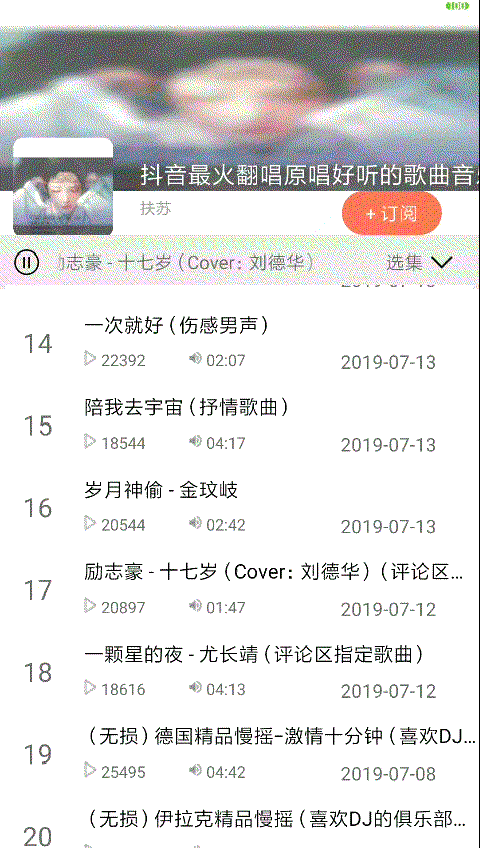

#040: 播放状态跑马灯效果

#[首页](./../README.md)

在有限空间显示更多内容，一种有效的方式就是使用跑马灯效果。

注意：只有在内容长度大于控制设置的最大长度时才有效果。

##1. 修改播放状态控件属性
主要设置一下几个属性：

	android:singleLine="true"
	android:ellipsize="marquee"
	android:marqueeRepeatLimit="marquee_forever"
同时在代码中对控件设置setSelected(true)

**activity_album_detail.xml:**

	<TextView
        android:id="@+id/id_album_player_status"
        android:layout_width="wrap_content"
        android:layout_height="wrap_content"
        android:textSize="14sp"
        android:singleLine="true"
        android:maxWidth="200dp"
        android:ellipsize="marquee"
        android:marqueeRepeatLimit="marquee_forever"
        android:layout_marginTop="10dp"
        android:layout_marginStart="12dp"
        android:text="@string/album_player_pause"
        app:layout_constraintStart_toEndOf="@id/iv_album_item_player"
        app:layout_constraintTop_toTopOf="@id/tv_album_item_play_container" />
        
**AlbumDetailActivity.java:**

	playStatusTextView = findViewById(R.id.id_album_player_status);
    playStatusTextView.setSelected(true);

##2. 效果图
