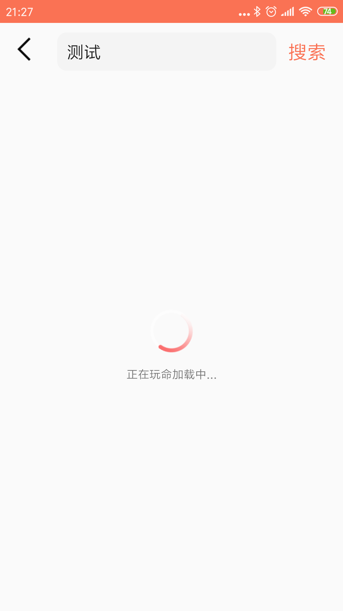
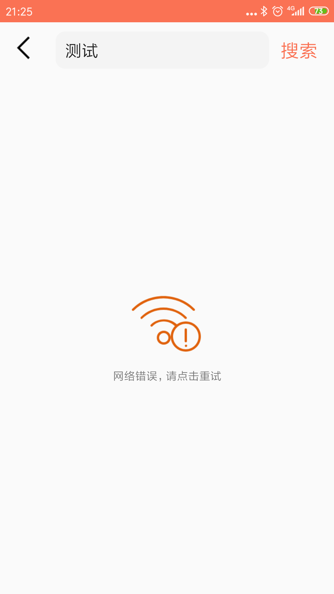

#045: 搜索功能实现

#[首页](./../README.md)

用户在搜索框中输入搜索关键词后点击搜素按钮，返回相应的搜索结果。结果存在几种情况，由于网络不通导致的要显示错误界面，并提示用户重试， 通过关键词没有搜到结果时提示搜索结果为空，如果能获取到正确的结果时，列出所有所有的结果。

##1. 通过UILoader添加不同结果界面

**SearchActivity.java:**

	if (uiLoader == null) {
        uiLoader = new UILoader(this) {
            @Override
            protected View getSuccessView(ViewGroup container) {
                return createSuccessView(container);
            }
        };
        uiLoader.setRetryClickListener(this);
        if (uiLoader.getParent() instanceof ViewGroup) {
            ((ViewGroup) uiLoader.getParent()).removeView(uiLoader);
        }
        searchContain.addView(uiLoader);
    }
         
##2. 创建搜索成功后的界面
###2.1 搜索成功的布局文件
**search_result_view.xml**

	<?xml version="1.0" encoding="utf-8"?>
	<androidx.constraintlayout.widget.ConstraintLayout xmlns:android="http://schemas.android.com/apk/res/android"
    xmlns:app="http://schemas.android.com/apk/res-auto"
    android:layout_width="match_parent"
    android:layout_height="match_parent">

    <androidx.recyclerview.widget.RecyclerView
        android:id="@+id/rv_search_result"
        android:layout_width="395dp"
        android:layout_height="715dp"
        app:layout_constraintBottom_toBottomOf="parent"
        app:layout_constraintEnd_toEndOf="parent"
        app:layout_constraintStart_toStartOf="parent"
        app:layout_constraintTop_toTopOf="parent" />
	</androidx.constraintlayout.widget.ConstraintLayout>
	
###2.2 获取搜索成功的控件并设置布局管理器和适配器

**SearchActivity.java:**

	private View createSuccessView(ViewGroup container) {
        View resultView = LayoutInflater.from(this).inflate(R.layout.search_result_view, container, false);
        searchResultImageView = resultView.findViewById(R.id.rv_search_result);
        LinearLayoutManager linearLayoutManager = new LinearLayoutManager(this);
        searchResultImageView.setLayoutManager(linearLayoutManager);
        albumAdapter = new AlbumAdapter();
        searchResultImageView.setAdapter(albumAdapter);
        return resultView;
    }

##3. 搜素按钮添加点击事件并更新正在加载界面
**SearchActivity.java:**

	searchBtn.setOnClickListener(new View.OnClickListener() {
        @Override
        public void onClick(View view) {
            String searchKeyword = searchInput.getText().toString().trim();
            if (!TextUtils.isEmpty(searchKeyword)) {
                searchPresenter.doSearch(searchKeyword);
                uiLoader.updateUIStatus(UILoader.UIStatus.LOADING);
            }
        }
    });

##4. 实现搜索结果成功或空或错误或回调

**SearchActivity.java:**

	@Override
    public void onSearchResult(List<Album> albums) {
        if (albums.size() == 0) {
            uiLoader.updateUIStatus(UILoader.UIStatus.EMPTY);
        }
        else {
            albumAdapter.updateData(albums);
            uiLoader.updateUIStatus(UILoader.UIStatus.SUCCESS);
        }
    }
    
    @Override
    public void onError(int errorCode, String errorMsg) {
        uiLoader.updateUIStatus(UILoader.UIStatus.ERROR);
    }
    
##5. 点击重试事件

	uiLoader.setRetryClickListener(this);
	@Override
    public void onRetry() {
        searchPresenter.reSearch();
        uiLoader.updateUIStatus(UILoader.UIStatus.LOADING);
    }
##6. 效果图
##6.1 加载页面

##6.2 错误页面

##6.3 空页面

##6.4 成功页面
